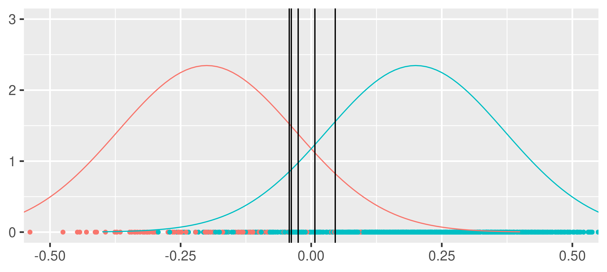

# Balanced Bagging (blagging) 

An example of blagging. In blagging one randomly undersamples the majority class in many bootstrap samples. This decreases the varince introduced by the undersampling routine.

